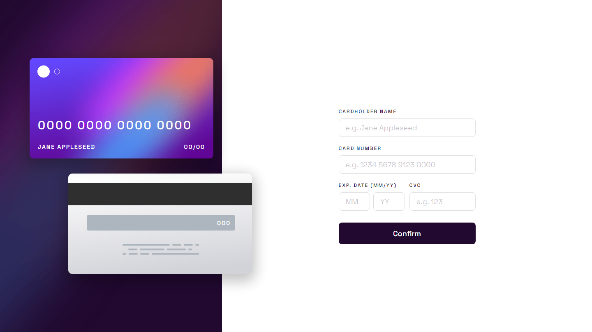

# Frontend Mentor - Interactive card details form solution

This is a solution to the [Interactive card details form challenge on Frontend Mentor](https://www.frontendmentor.io/challenges/interactive-card-details-form-XpS8cKZDWw). Frontend Mentor challenges help you improve your coding skills by building realistic projects.

## Table of contents

- [Overview](#overview)
  - [The challenge](#the-challenge)
  - [Screenshot](#screenshot)
  - [Links](#links)
- [My process](#my-process)
  - [Built with](#built-with)
  - [What I learned](#what-i-learned)
  - [Continued development](#continued-development)
- [Author](#author)

## Overview

### The challenge

Users should be able to:

- Fill in the form and see the card details update in real-time
- Receive error messages when the form is submitted if:
  - Any input field is empty
  - The card number, expiry date, or CVC fields are in the wrong format
- View the optimal layout depending on their device's screen size
- See hover, active, and focus states for interactive elements on the page

### Screenshot

### Links

- Solution URL: [GitHub Repo](https://github.com/ryanbradley-webdev/interactive-card-details-form)
- Live Site URL: [Hosted on Netlify](https://interactive-card-details-form-rbwd.netlify.app/)

## My process

### Built with

- [React](https://reactjs.org/) - JS library

### What I learned

I learned how to improve my responsive design skills with this project, especially with the overflowing cards on screen. After playing around with breakpoints and sizing to ensure the design remains true to the specification while also being responsive and consistent, I found a solution that accomplishes both.

### Continued development

Form validation continues to be a challenge, and I'm continuing to experiment with different methods of accomplishing this. For this project I used dedicated input components with state specifically for valid status. In the future I plan on integrating this technique with a more sophisticated and robust method of form submission and error handling.

## Author

- Visit my portfolio - [ryanbradleyportfolio.com](https://ryanbradleyportfolio.com)
- Contact me for your next website - [ryanbradleywebdev.com](https://ryanbradleywebdev.com)
- Email me - [ryan@ryanbradleywebdev.com](ryan@ryanbradleywebdev.com)
- Follow my Instagram - [@ryanbradley_web_dev](https://www.instagram.com/ryanbradley_web_dev/)